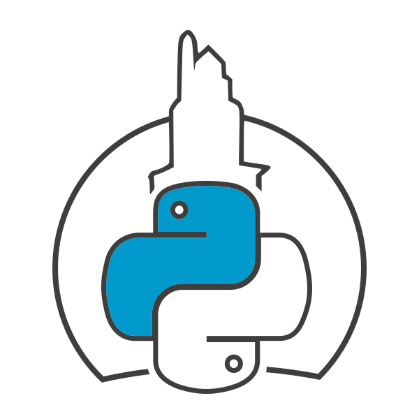

<div align="center" style="background-color: white; border-radius: 15px; border-color: black; border-width: 2px; padding: 10px;">
  
  
</div>

# FastAPI + Railway Workshop @ AtlanticaConf

Welcome to the **FastAPI Workshop** for AtlanticaConf! In this session, we'll explore how to build and containerize a
FastAPI application.

## 🚀 Project Overview

This project is a simple FastAPI-based application created for hands-on learning during the workshop.

## 🧩 Workshop Challenge

As part of this workshop, we have a practical Dockerization challenge for you:

### 🔧 Challenge 1: Dockerize the App

Use the provided `docker-compose.workshop.yaml` and `Dockerfile.workshop` to containerize the application.

#### Your Tasks:

1. Create a `.docker` folder to organize everything related to Dockerization, such as Dockerfiles and helper scripts.
2. Rename the files:

    * `docker-compose.workshop.yaml` → `docker-compose.yaml`
    * `Dockerfile.workshop` → `Dockerfile`
3. Move the renamed `Dockerfile` into the `.docker` folder.
4. Update your `docker-compose.yaml` to reflect the new `Dockerfile` path, if needed.
5. Build and run the app using Docker Compose:

   ```bash
   docker-compose up --build
   ```

### 🏁 Bonus Challenge: Add a Healthcheck

Once your app is up and running, level up with this bonus task:

- Add a `healthcheck` to the `event_manager` service in your `docker-compose.yaml`.
- Use the FastAPI endpoint provided for health status (e.g., `/health` or similar).

### 💬 Need Help?

Don't hesitate to ask questions during the session or pair up with fellow attendees. Collaboration is encouraged!
